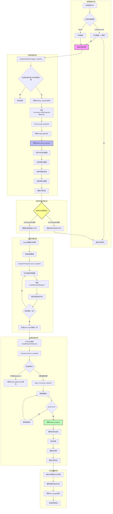

## 日志快照机制

```mermaid
graph TB
    subgraph "快照触发阶段"
        A[应用程序写入] --> B{检查快照策略}
        B -->|LogsSinceLast| C[日志数量 >= 阈值?]
        B -->|Never| D[手动触发]
        C -->|是| E[触发快照构建]
        D --> E
        C -->|否| F[继续正常操作]
    end
    
    subgraph "快照构建阶段"
        E --> G[SnapshotHandler.trigger_snapshot]
        G --> H{检查是否有进行中的快照构建}
        H -->|有| I[跳过构建]
        H -->|无| J[设置building_snapshot标志]
        J --> K[发送Command::BuildSnapshot到Worker]
        K --> L[Worker.build_snapshot]
        L --> M[获取SnapshotBuilder]
        M --> N[调用builder.build_snapshot]
        N --> O[序列化状态机数据]
        O --> P[生成快照元数据]
        P --> Q[保存快照到存储]
        Q --> R[返回快照元数据]
        R --> S[更新引擎状态]
    end
    
    subgraph "快照传输决策阶段"
        S --> T1{检查日志清理状态}
        T1 -->|主节点日志已清理| T2[需要发送快照给从节点]
        T1 -->|主节点日志未清理| T3[直接发送日志给从节点]
        T3 --> F
    end
    
    subgraph "快照传输阶段"
        T2 --> T[Leader需要发送快照] --> U[获取快照数据]
        U --> V[SnapshotTransport.send_snapshot]
        V --> W[分块读取快照数据]
        W --> X[创建InstallSnapshotRequest]
        X --> Y[通过网络发送分块]
        Y --> Z{是否最后一块?}
        Z -->|否| W
        Z -->|是| AA[发送done=true的最后一块]
    end
    
    subgraph "快照安装阶段"
        AA --> BB[Follower接收InstallSnapshotRequest]
        BB --> CC[Chunked.receive_snapshot]
        CC --> DD{检查快照ID}
        DD -->|不匹配且offset!=0| EE[返回SnapshotMismatch错误]
        DD -->|匹配或新快照| FF[begin_receiving_snapshot]
        FF --> GG[接收数据块]
        GG --> HH{done=true?}
        HH -->|否| II[缓存数据块]
        II --> GG
        HH -->|是| JJ[调用install_snapshot]
        JJ --> KK[替换状态机状态]
        KK --> LL[保存快照]
        LL --> MM[删除旧快照]
        MM --> NN[更新引擎状态]
    end
    
    subgraph "日志清理阶段"
        NN --> OO[确定可清理的日志范围]
        OO --> PP[删除快照包含的日志]
        PP --> QQ[更新last_purged指针]
        QQ --> RR[完成快照安装]
    end
    
    style E fill:#f9f,stroke:#333,stroke-width:2px
    style N fill:#bbf,stroke:#333,stroke-width:2px
    style JJ fill:#bfb,stroke:#333,stroke-width:2px
    style T1 fill:#ff9,stroke:#333,stroke-width:2px
```